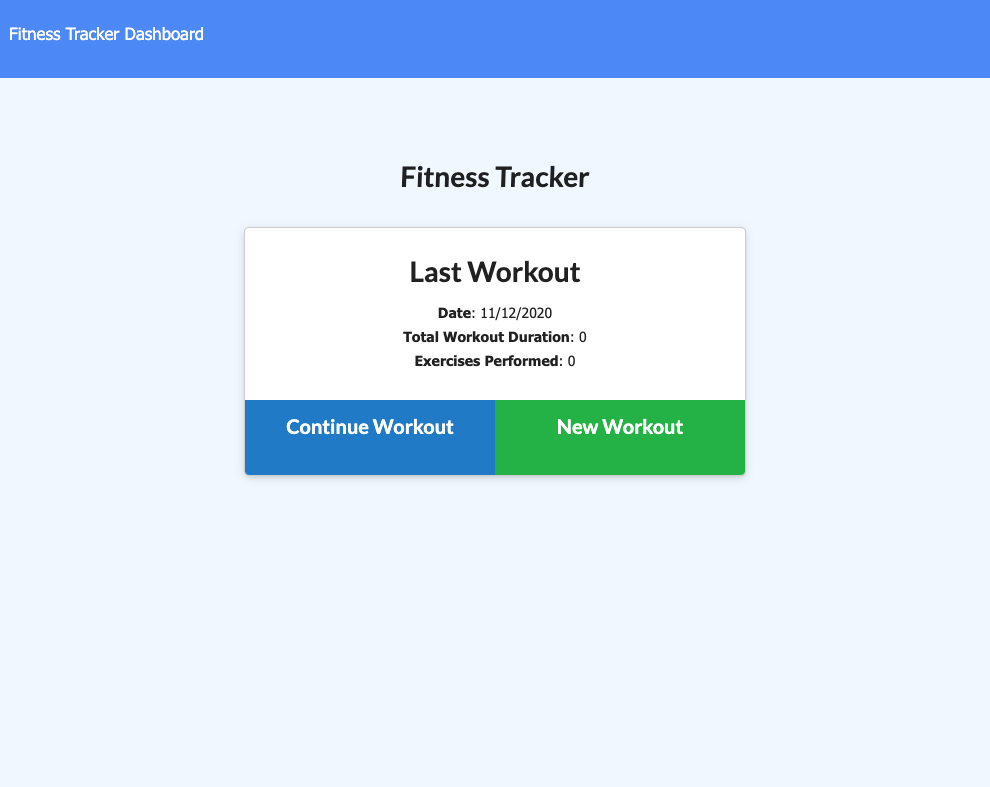
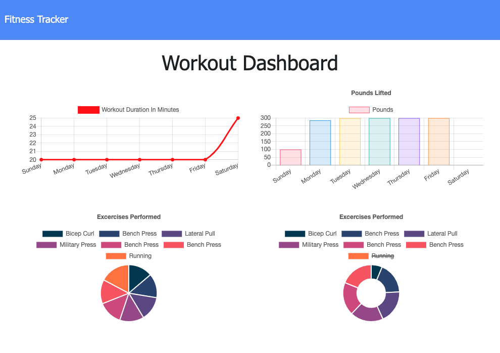

# NOSQL-WORKOUT-TRACKER

## Table of Contents
* Description
* User Story
* Production Team
* How to Use
* Demo Link
* Screenshot
* Technology
* Sources
* Additional Questions   

## Description 
This project has created a workout tracker app using a Mongo database with a Mongoose schema and handle routes with Express.

## User Story

* As a user, I want to be able to view create and track daily workouts. I want to be able to log multiple exercises in a workout on a given day. I should also be able to track the name, type, weight, sets, reps, and duration of exercise. If the exercise is a cardio exercise, I should be able to track my distance traveled.

## Production Team
* [Alex Eesley ](https://github.com/aeesley)

## How to Use
Add new exercises to complete a workout, or continue a previous workout. Get all of the stats on your previous workout, and see dynamic graphs on the stats page of your workout history.

## Demo Links 
[Heroku](https://workout-tracker-23456464.herokuapp.com/)

[Github](https://github.com/aeesley/nosql-workout-tracker)

## Screenshot

# Technology
Mongo, Mongoose, Github, Node, JQuery, Express, Atlas, Heroku, HTML, CSS etc.

# Sources
Worked through this project using past class activities and help from a tutor session.

## Additional Questions
If you have any questions about the project, please reach out through GitHub.
